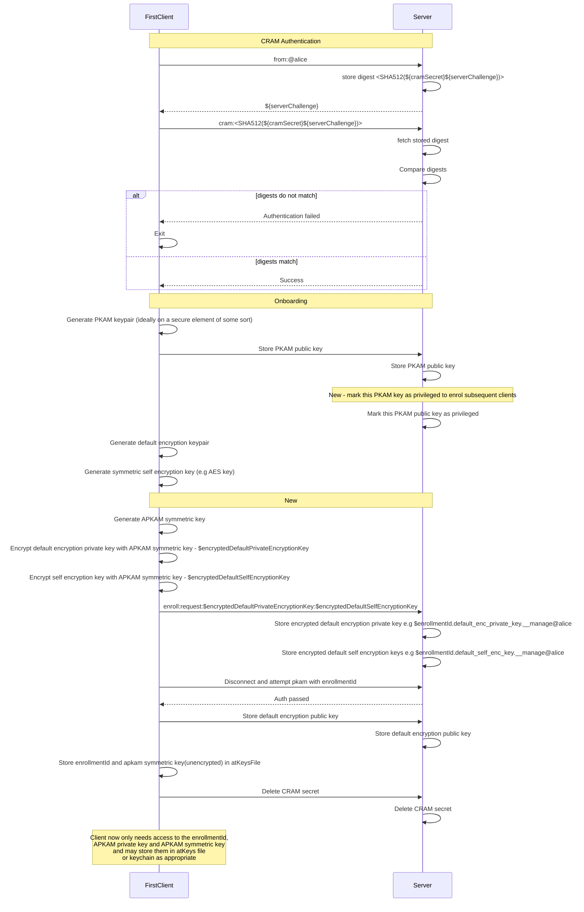
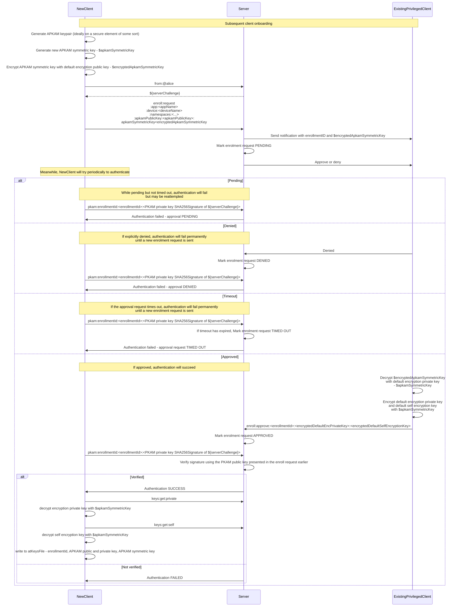
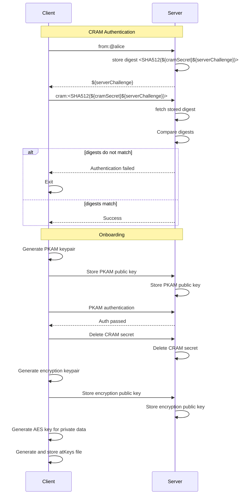
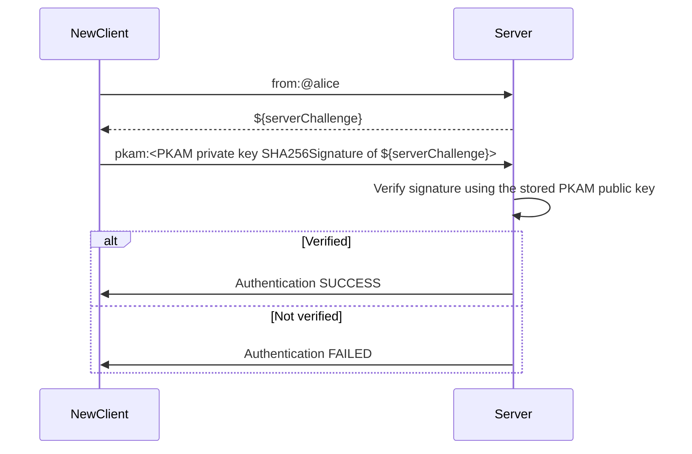

# PKAMs per app per device

* **Status:** Draft
* **Created:** 2023-01
* **Changelog:**
  * 2023-04-03 Added mermaid sequence diagrams of current and proposed new flows
* **Objective:** Define protocol interactions required to have different PKAMs
  per app+device

<!-- TOC -->
* [PKAMs per app per device](#pkams-per-app-per-device)
  * [Context & Problem Statement](#context--problem-statement)
  * [Goals](#goals)
    * [Non-goals](#non-goals)
  * [Other considerations](#other-considerations)
  * [Proposal Summary](#proposal-summary)
  * [Proposal In Detail](#proposal-in-detail)
    * [Initial bootstrap enrollment](#initial-bootstrap-enrollment)
      * [Overview](#overview)
      * [Description](#description)
      * [Sequence diagram](#sequence-diagram)
    * [All subsequent enrollments](#all-subsequent-enrollments)
      * [Overview](#overview-1)
      * [Description](#description-1)
      * [Sequence diagram](#sequence-diagram-1)
    * [Other details](#other-details)
  * [Appendix - current flows](#appendix---current-flows)
    * [First client onboarding](#first-client-onboarding)
    * [Subsequent client onboarding](#subsequent-client-onboarding)
<!-- TOC -->

## Context & Problem Statement
Current PKAM (Public Key Authentication Method) supports only a single keypair.
- Key pairs are created by first device/app on the edge.
- Device/app holds the private key; the public key is placed on the secondary server
- Access is “all or nothing” - access to the private key delivers access to everything
- atSign owners are asked to manage/store keys, safely.
  - This is always tricky
  - Inevitable that atSign owners will sometimes accidentally leak keys
- Apps require the atSign owner to give the keys to the app
- Authentication flow, given an existing PKAM keypair, is
  - App sends `from:@alice` to `@alice`'s atServer
  - atServer responds with a challenge `data:<challenge>`
  - App signs the challenge with its PKAM private key, sends `pkam:<signature>`
  - atServer verifies the signature against the PKAM public key which it knows

## Goals
- Limit likelihood of compromise of private keys
  - Limit private keys required by apps to the bare minimum - a single keypair whose
    private key may be held on a TPM / secure element
  - No more exporting of keys files for import by other apps+devices
  - Easy-to-use management of app access and app namespace permissions
- Limit blast radius if private keys are compromised
  - Apply access controls to apps' use of the atSign's namespace
  - Easy-to-use modification / revocation of app access and app namespace permissions

### Non-goals

## Other considerations

## Proposal Summary
This proposal is based upon, and expands upon, [this summary proposal](https://docs.google.com/presentation/d/1Yo30hVGfasBEZqeYGNlhhuqLbLLE-l6Qm8RpbBGvNBs/edit#slide=id.gd1dd4acffa_0_5)
- APKAM (Application PKAM) - a keypair per app+device
- MPKAM - an APKAM which has access to the `.__manage` namespace
- APKAM enrollment requests can be approved only by apps which have an MPKAM
- Device/app stores the minimum amount of information
  - unique enrollment ID
  - keys
    - the APKAM keypair
      - the private key may be held on a TPM
    - an APKAM symmetric key specific to this enrollment
      - This is required because
        - the approving app needs to be able to send private key(s) to the
          enrolling app
        - the APKAM private key may be on a TPM which does not support
          using the private key for decryption but only for signing
- An enrollment interaction flow will
  - Allow new apps to request that their app+device be approved and have
    their APKAM public key stored on the atServer
  - Allow requests to be approved or denied by another existing app with the
    appropriate authority
  - Make encryption keypairs' private keys and symmetric keys available as
    appropriate to the newly enrolled app by encrypting with the APKAM
    **symmetric** key
- After enrollment, an app needs to be able to
  - Authenticate with APKAM keypair and enrollment id
  - Fetch all keys which have been shared with this enrollment id
    - And decrypt those keys using the APKAM **symmetric** key
- There must be a way to revoke enrollment of a given APKAM
  - an enrolled app should be able to revoke its own enrollment
- Additions to `pkam` verb syntax
- New verb `enroll` for enrollment management
- New verb `keys` for management of (1) encryption keypairs (2) 'self' encryption keys

## Proposal In Detail
### Initial bootstrap enrollment
#### Overview
- Do CRAM and PKAM as done prior to APKAM
- Then follow up with an `enroll` request

#### Description
In addition to what is done now (CRAM auth, PKAM auth, cutting default 
encryption keypair and default 'self' encryption key), the client 
also
- generates an 'APKAM symmetric key' and encrypts it with default encryption 
  public key
- client stores two keys on the server via `enroll` request
  - default self encryption key - encrypted with APKAM symmetric key
  - default encryption private key - encrypted with APKAM symmetric key
- client only need to store their enrollmentID, APKAM private key and APKAM
  symmetric key - however, for backwards compatibility will store 
  those things in addition to everything that is in the current atKeys file 
  format

#### Sequence diagram


### All subsequent enrollments
This is _**substantially**_ different from how things are now.

#### Overview
- An `enroll:request` command results in a keyStore entry being created in the
  `__manage` namespace and a notification being generated on the server and  
  delivered to apps which have permission to approve or deny the request
- Apps which have access can approve or deny the request

#### Description
- NewApp sends enroll request
  - atServer creates a private keyStore entry in the `.__manage` namespace. The key for
    the entry is `<enrollmentId>.new.enrollments.__manage@atSign`, where `<enrollmentId>` is
    some random id and the data stored is something like
      ```json
        {
          "sessionID": "<the session ID of the NewApp connection>",
          "appName":"<appName>",
          "deviceName":"<deviceName>",
          "namespaces": [
            {"ns":"one","ac": "r"},
            {"ns":"two","ac": "rw"},
            {"ns":"three","ac": "r"}
            ],
          "APKAMPublicKey":"APKAMPublicKey",
          "requestType": "newEnrollment",
          "approval": {"state":"requested"}
        }
      ```
  - atServer generates a notification for this keyStore entry. Only apps which have
    access to the `.__manage` namespace will receive this notification.
  - atServer responds to NewApp with the usual PKAM challenge `data:<challenge>`
  - NewApp tries `pkam`
    - If the enrollment has not yet been approved, get an error code for "Enrollment request not yet approved"
      and can retry `pkam` again
    - If the enrollment has been denied, get a fatal error code for "Enrollment request denied",
      and NewApp may no longer retry the `pkam`
    - Once the enrollment has been approved, then the response will be accepted
    - NewApp may then retrieve encryption private keys and self encryption keys
      - `keys:get:private`
      - `keys:get:self`
  - An already-enrolled app ('ExistingApp') with access to the `.__manage` namespace
    - Receives and decrypts the notification.
    - Display the request details, and ask the user to approve or deny it
    - **Approve:**
      - `enroll:approve:<enrollmentId>:<encryptedDefaultEncPrivateKey:<encryptedDefaultSelfEncryptionKey>`
      - atServer marks the enrollment request as `approved`
    - **Deny:**
      - `enroll:deny:<approvalID>`
      - atServer marks the enrollment request as `denied`
  - atServer will set timers to expire approval requests after a suitable configurable
    interval (e.g. 90 seconds). Expired approval requests will be deleted.
  - Upon startup, atServer will load all approval requests with approval state "requested",
    delete them if they have already passed the expiry interval, and set an appropriate expiry
    timer otherwise
  - When a request is approved, atServer stores the APKAMPublicKey in an entry with
    key name `public:appName.deviceName.pkam.__pkams.__public_keys`

#### Sequence diagram


### Other details
- `info` verb will additionally include details of the APKAM's namespace access
- All existing verb implementations must change to respect APKAM namespace access controls
- `enroll` verb should be rate-limited
- `__global` namespace is ONLY used for storing globally accessible keys. It is
  not usable by any other verb lookup/update/delete/notify/etc
- Types of enrollment requests. Types are determined by the server
  - newEnrollment
  - overrideEnrollment (app wanting to enroll a new public key)
  - changeNamespaceAccess
  - revokeEnrollment
- MPKAM apps need access to all encryption private keys
  - If an app being enrolled requires __manage access, then share all encryption private keys with them
  - So they can share the relevant subset with other apps as they enroll
  - Corollary: When an encryption keypair is created in a namespace, it must be shared (1) with all apps which
    have access to the namespace (2) with all apps who have the MPKAM access (__shared namespace)

## Appendix - current flows

### First client onboarding

### Subsequent client onboarding
Use the PKAM keys from the atKeys file which was generated during first client onboarding


