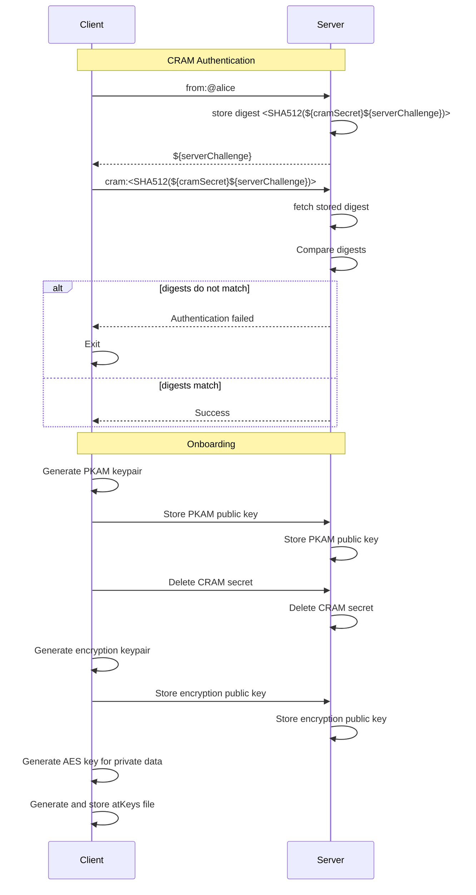
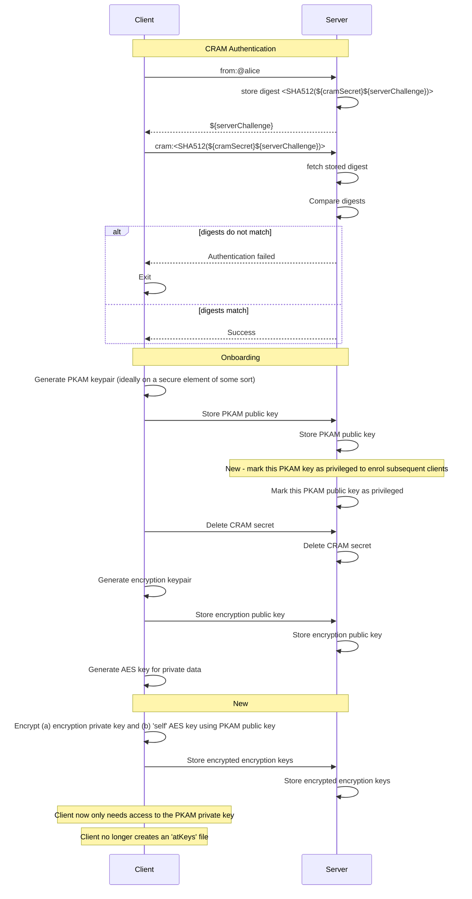
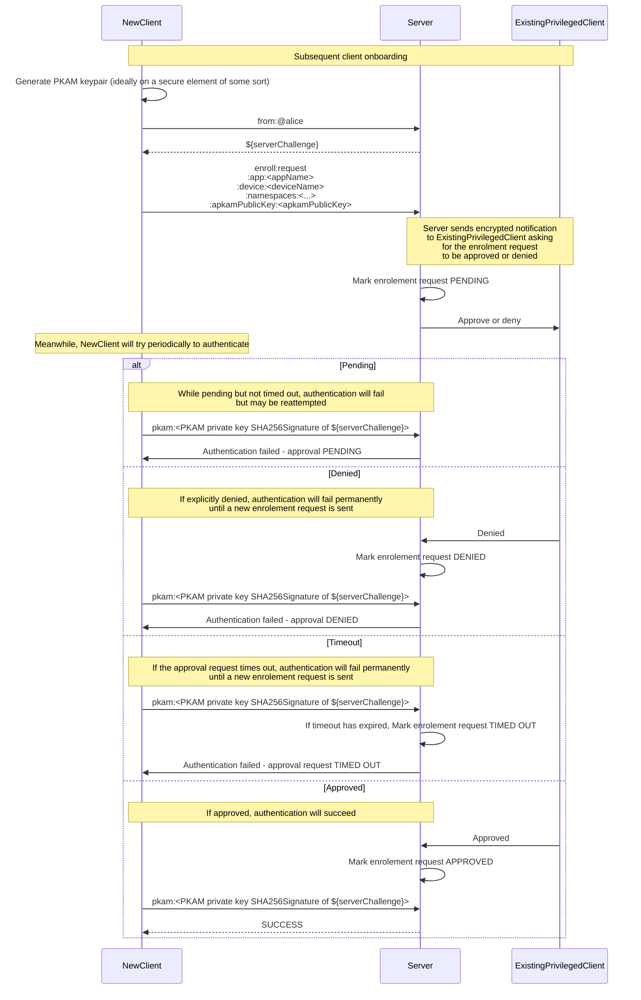

# PKAMs per app+device

* **Status:** Draft
* **Last Updated:** 2023-01
* **Objective:** Define protocol interactions required to have different PKAMs
per app+device

<!-- TOC -->
* [PKAMs per app+device](#pkams-per-appdevice)
  * [Context & Problem Statement](#context--problem-statement)
  * [Goals](#goals)
    * [Non-goals](#non-goals)
  * [Other considerations](#other-considerations)
  * [Proposal Summary](#proposal-summary)
  * [Proposal In Detail](#proposal-in-detail)
    * [Initial bootstrap - onboard FirstApp](#initial-bootstrap---onboard-firstapp)
    * [Subsequent runs of FirstApp](#subsequent-runs-of-firstapp)
    * [Enrollment flow](#enrollment-flow)
      * [Overview](#overview)
      * [Details](#details)
    * [SecondApp](#secondapp)
    * [Other details](#other-details)
<!-- TOC -->
* TODO
  * Add mermaid sequence diagrams for all the interaction flows below

## Context & Problem Statement
Current PKAM (Public Key Authentication Method) supports only a single keypair.
- Key pairs are created by first device/app on the edge.
- Device/app holds the private key; the public key is placed on the secondary server
- Access is “all or nothing” - access to the private key delivers access to everything
- atSign owners are asked to manage/store keys, safely.
  - This is always tricky
  - Inevitable that atSign owners will sometimes accidentally leak keys
- Apps require the atSign owner to give the keys to the app
- Authentication flow, given an existing PKAM keypair, is
  - App sends `from:@alice` to `@alice`'s atServer
  - atServer responds with a challenge `data:<challenge>`
  - App signs the challenge with its PKAM private key, sends `pkam:<signature>`
  - atServer verifies the signature against the PKAM public key which it knows

## Goals
- Limit likelihood of compromise of private keys
  - Limit private keys required by apps to the bare minimum - a single keypair whose
  private key may be held on a TPM / secure element
  - No more exporting of keys files for import by other apps+devices
  - Easy-to-use management of app access and app namespace permissions
- Limit blast radius if private keys are compromised
  - Apply access controls to apps' use of the atSign's namespace
  - Easy-to-use modification / revocation of app access and app namespace permissions

### Non-goals

## Other considerations

## Proposal Summary
This proposal is based upon, and expands upon, [this summary proposal](https://docs.google.com/presentation/d/1Yo30hVGfasBEZqeYGNlhhuqLbLLE-l6Qm8RpbBGvNBs/edit#slide=id.gd1dd4acffa_0_5)
- APKAM (Application PKAM) - a keypair per app+device
- MPKAM - an APKAM which has access to the `.__manage` namespace
- APKAM enrollment requests can be approved only by apps which have an MPKAM
- Device/app holds only the APKAM private key
  - and of course this private key may be held on a TPM
- An enrollment interaction flow allows
  - apps to request that their app+device be approved and have their APKAM public key
    stored on the atServer
  - requests to be approved or denied by another existing app with the appropriate authority
- Encryption private keys are made available to the new app by encrypting with their APKAM public key
- 'Self' encryption keys are made available to the new app; these are encrypted with the encryption
  public keys corresponding with the above-mentioned encryption private keys
- There must be a way to cease use of old encryption keypairs in favour of newer ones
- There must be a way to revoke enrollment of a given APKAM
- Additions to `pkam` verb syntax
- New verb `enroll` for enrollment management
- New verb `keys` for management of (1) encryption keypairs (2) 'self' encryption keys

## Proposal In Detail
### Initial bootstrap - onboard FirstApp
- FirstApp does a CRAM authentication
- FirstApp enrolls itself and its APKAM
  - Cut its APKAM encryption keypair (or get the APKAM public key from a TPM / Secure Element)
  - Enrolls:
    ```
    enroll:request:app:<appName>:device:<deviceName>
    :namespaces:<one,r;two,rw;three,r[;...]
    :apkamPublicKey:<apkamPublicKey>
    ```
  - automatically approved because app has authenticated with CRAM secret
  - and given rw access to the `__manage` namespace
- FirstApp disconnects, creates a new connection and does APKAM authentication
  `from:@atSign`, and then
  `pkam:app:<appName>:device:<deviceName>:<signedChallenge>`
- Create default encryption keypair
  - FirstApp cuts a default encryption keypair and gives it a name e.g. firstKey
  - FirstApp stores the default encryption keypair's public key
    ```
    keys:put:public
      :keyName:firstKey:namespace:__global
      :keyType:<RSA-2048|eccxyz|etc>
      :<public key base64 encoded>
    ```
    - public key is stored in `public:<keyName>.__public_keys.__global@atSign`
      - with `keyType` in the metadata
    - For backwards compatibility, also stores `public:publickey@atSign` as a
      reference to `public:<keyName>.__public_keys.__global@atSign`
  - FirstApp encrypts the default encryption keypair's private key using FirstApp's
  apkamPublicKey, and stores it for later use by FirstApp
    ```
    keys:put:private:app:<appName>:device:<deviceName>
      :keyName:firstKey:namespace:__global
      :<encryptedEncryptionPrivateKey
    ```
    - appName and deviceName must match what was used in PKAM
    - Creates key `private:<appName>.<deviceName>.<keyName>.__private_keys.__global@atSign`
      - with value being <encryptedEncryptionPrivateKey>
- Create a default 'self' encryption key
  - FirstApp cuts new symmetricSelfEncryptionKey (e.g. an AES key)
  - Encrypts it using default global encryption public key e.g. firstKey
  - Stores it
    ```
    keys:put:self
    :keyName:<keyName>:namespace:__global
      :keyType:<AES-256|XYZ-128|etc>:encryptionKeyName:<keyName e.g. firstKey>
      :<encryptedSymmetricSelfEncryptionKey>
    ```
    - stored in `<keyName>.__self_keys.__global@atSign`
    - with `keyType` and `encryptionKeyName` in the metadata

### Subsequent runs of FirstApp
- Do APKAM authentication
- Retrieve all encryption keypairs' private keys
  - `keys:get:private`
    - Retrieves everything from the `__private_keys.__global` namespace
    - Retrieves everything from `__private_keys.$namespace` for each $namespace to
      which this app has access
  - (Recall that these are encrypted with FirstApp's APKAM private key)
- Retrieve all self encryption keys
  - `keys:get:self`
    - Retrieves everything from the `__self_keys.__global` namespace
    - Retrieves everything from `__self_keys.$namespace` for each $namespace to
      which this app has access
  - (Recall that these are encrypted with some encryption keypair's public key)

### Enrollment flow
#### Overview
- An `enroll:request` command results in a keyStore entry being created in the `__manage` namespace
  and an auto-notification being generated
- Apps which have access can approve or deny the request

#### Details
  - NewApp sends
    ```
    enroll:request:app:<appName>:device:<deviceName>
    :namespaces:<one,r;two,rw;three,r[;...]
    :apkamPublicKey:<apkamPublicKey>
    ```
    - atServer creates a private keyStore entry in the `.__manage` namespace. The key for
      the entry is `<approvalID>.new.enrollments.__manage@atSign`, where `<approvalID>` is
      some random id and the data stored is
      ```json
      {
        "sessionID": "<the session ID of the NewApp connection>",
        "appName":"<appName>",
        "deviceName":"<deviceName>",
        "namespaces": [
          {"ns":"one","ac": "r"},
          {"ns":"two","ac": "rw"},
          {"ns":"three","ac": "r"}
          ],
        "APKAMPublicKey":"APKAMPublicKey",
        "requestType": "newEnrollment",
        "approval": {"state":"requested"}
      }
      ```
    - atServer generates a notification for this keyStore entry. Only apps which have
    access to the `.__manage` namespace will receive this notification.
    - atServer responds to NewApp with the usual PKAM challenge `data:<challenge>`
    - NewApp tries `pkam`
      - If the enrollment has not yet been approved, get an error code for "Enrollment request not yet approved"
        and can retry `pkam` again
      - If the enrollment has been denied, get a fatal error code for "Enrollment request denied",
        and NewApp may no longer retry the `pkam`
      - Once the enrollment has been approved, then the response will be accepted
      - NewApp may then retrieve encryption private keys and self encryption keys
        - `keys:get:private`
        - `keys:get:self`
    - An already-enrolled app ('ExistingApp') with access to the `.__manage` namespace
      - Receives and decrypts the notification.
      - Display the request details, and ask the user to approve or deny it
      - **Approve:**
        - `enroll:approving:<approvalID>`
          - atServer updates the enrollment request record's "approval" field, e.g.
          ```
            "approval": {
              "state":"approving",
              "approverAppName": "ExistingApp",
              "approvedDeviceName": "<deviceName>"
            }
          ```
        - Make all encryption private keys available to NewApp
          - Retrieve all encryption keypairs' private keys
            - `keys:get:private`
              - Retrieves everything from the `__private_keys.__global` namespace
              - Retrieves everything from `__private_keys.$namespace` for EVERY $namespace to
                which NewApp app will have access
            - (Recall that these are encrypted with ExistingApp's APKAM private key)
          - Fetch NewApp's APKAM public key
          - Encrypt each private key and store for NewApp
            ```
            keys:put:private:app:<appName>:device:<deviceName>
              :keyName:<keyName>:namespace:<namespace>
              :<encryptedEncryptionPrivateKey>
      - **Deny:**
        - `enroll:deny:<approvalID>`
          - atServer updates the enrollment request record's "approval" field, e.g.
          ```
            "approval": {
              "state":"denied",
              "approverAppName": "ExistingApp",
              "approvedDeviceName": "<deviceName>"
            }
          ```
      - atServer will set timers to expire approval requests after a suitable configurable
        interval (e.g. 90 seconds). Expired approval requests will be deleted.
      - Upon startup, atServer will load all approval requests with approval state "requested",
        delete them if they have already passed the expiry interval, and set an appropriate expiry
        timer otherwise
    - When a request is approved, atServer stores the APKAMPublicKey in an entry with
      key name `public:appName.deviceName.pkam.__pkams.__public_keys`

### SecondApp

### Other details
- `info` verb will additionally include details of the APKAM's namespace access
- All existing verb implementations must change to respect APKAM namespace access controls
- `enroll` verb should be rate-limited
- `__global` namespace is ONLY used for storing globally accessible keys. It is
  not usable by any other verb lookup/update/delete/notify/etc
- Types of enrollment requests. Types are determined by the server
  - newEnrollment
  - overrideEnrollment (app wanting to enroll a new public key)
  - changeNamespaceAccess
- MPKAM apps need access to all encryption private keys
  - If an app being enrolled requires __manage access, then share all encryption private keys with them
  - So they can share the relevant subset with other apps as they enroll
  - Corollary: When an encryption keypair is created in a namespace, it must be shared (1) with all apps which 
    have access to the namespace (2) with all apps who have the MPKAM access (__shared namespace)

## Diagrams - current flows

* Clients need to store PKAM private key, encryption private key, and AES key for private data (aka 'self' encryption
  key)

### First client onboarding

### Subsequent client onboarding
Use the atKeys file generated during first client onboarding 

## Diagrams - proposed new flows
Clients retain only a PKAM private key

### Initial client enrolment

Very similar to how things are now except
1. clients encrypt, with their PKAM public key, and then store on the server
   1. the encryption private key and
   2. the 'self' encryption key
2. clients only need to store their PKAM private key




### Subsequent client enrolment
This is _**substantially**_ different from how things are now.


