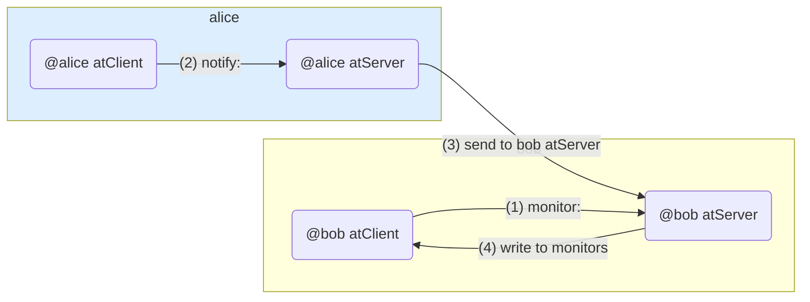
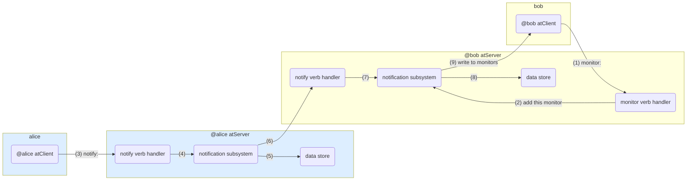
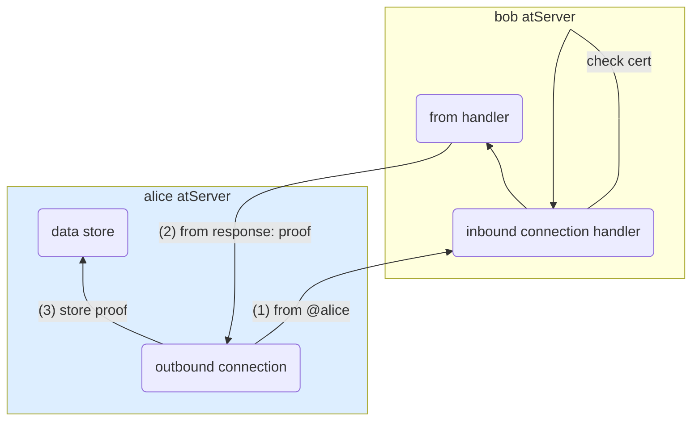
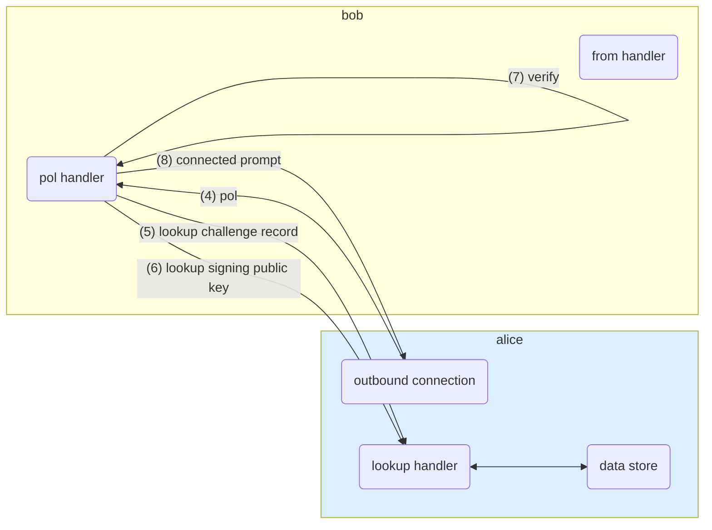

# How atProtocol notifications work

## High level

## More detail

## atClient to atServer 'PKAM' authentication

See [this diagram](./how-to-exchange-encrypted-data.md#sequence-diagram)

## atServer-to-atServer authentication

### 1) "from:@alice"

### 2) "pol" (proof of life)

