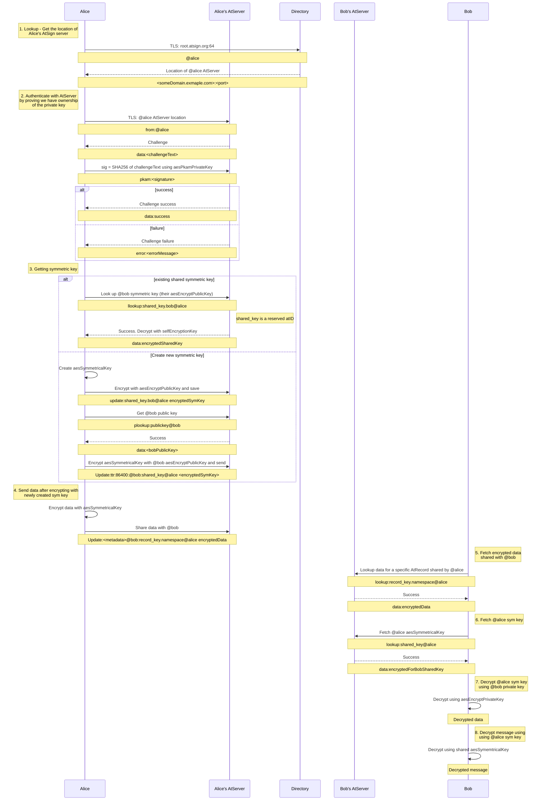

## How to exchange encrypted data

* **Status:** **Draft** / Approved / Rejected / Superseded
* **Last Updated:** 2023-01-25
* **Objective:** Explain how an authenticated atSign client exchanges data with another atSign


<!-- TOC -->
  * [How to exchange encrypted data](#how-to-exchange-encrypted-data)
  * [Background](#background)
  * [Goals](#goals)
    * [Non-goals](#non-goals)
  * [Technical prerequisites](#technical-prerequisites)
  * [Specification](#specification)
    * ["Sending" atSign](#-sending--atsign)
      * [1. Lookup address of the _@alice_ atServer](#1-lookup-address-of-the-alice-atserver)
      * [2. Authenticate to _@alice_ atServer](#2-authenticate-to-alice-atserver)
      * [3a. Fetch existing shared symmetric key if it has already been created,](#3a-fetch-existing-shared-symmetric-key-if-it-has-already-been-created)
      * [3b. or create a new shared symmetric key](#3b-or-create-a-new-shared-symmetric-key)
      * [4. Encrypt some data](#4-encrypt-some-data)
      * [5. Share the data with _@bob_](#5-share-the-data-with-bob)
    * ["Receiving" atSign](#-receiving--atsign)
      * [1. Lookup address of the _@bob_ atServer](#1-lookup-address-of-the-bob-atserver)
      * [2. PKAM authenticate to _@bob_ atServer](#2-pkam-authenticate-to-bob-atserver)
      * [3. Fetch the data which _@alice_ shared](#3-fetch-the-data-which-alice-shared)
      * [4. Fetch the symmetric key which _@alice_ shared](#4-fetch-the-symmetric-key-which-alice-shared)
      * [5. Decrypt the data using the symmetric key](#5-decrypt-the-data-using-the-symmetric-key)
    * [Key Descriptions](#key-descriptions)
    * [Sequence Diagram](#sequence-diagram)
  * [Other resources](#other-resources)
<!-- TOC -->

## Background

Some details of how the atPlatform works are not specified in detail by the atProtocol itself, but are
usage conventions which are embedded in the client SDKs. As a result, building new client software, be
it in a new language or building alternative client software for a language for which client software
is already available, currently requires the engineer to base their efforts upon existing client libraries
rather than a language-agnostic specification of the minimum functionality required.

## Goals

Given a client which has access to keys from a completed onboarding, provide a detailed specification
of how the client can securely exchange data with another atSign.

### Non-goals
- This document does not cover client onboarding. 
  - TODO: Create such a document

## Technical prerequisites
Ability to
- create RSA encryption public/private keypairs and use them to do encryption and decryption
- cryptographically sign data using a private key, and verify signatures using a public key
- create AES encryption keys and use them to do encryption and decryption
- establish a TLS socket connection, and be able to use it to send and receive data
- base64 encoding/decoding

## Specification
### "Sending" atSign
Given an already-onboarded client (i.e. access to authentication private key and encryption private key) for atsign 
`@alice`
#### 1. Lookup address of the _@alice_ atServer
- Establish TLS connection to root.atsign.org:64
- Send `alice\n`
- Expect response in form `<someDomain.example.com>:<port>`
#### 2. Authenticate to _@alice_ atServer
- Establish TLS connection to the address of the `@alice` atServer
- do PKAM authentication
  - Send `from:@alice`
  - Expect response in form `data:<challengeText>`
  - Create a base64-encoded SHA256 signature of `challengeText` using the client's PKAM private key
    - Dart code example
    ```dart
      var key = RSAPrivateKey.fromString(privateKey);
      var sha256signature = key.createSHA256Signature(utf8.encode(challengeText) as Uint8List);
      var signature = base64Encode(sha256signature);
    ```
  - Send `pkam:<signature>`
  - Expect response `data:success` (or `error:<errorMessage>` if the signature could not be verified by the atServer
    using the corresponding PKAM public key)
#### 3a. Fetch existing shared symmetric key if it has already been created,
- Send `llookup:shared_key.bob@alice` // This is a copy of the symmetric key which is encrypted with `@alice`'s 
  public encryption key
- If response like `data:<base64EncodedEncryptedSharedKey>`
  - Decode from bas64, then decrypt using our private encryption key. The result will be a symmetric key, 
    base64-encoded. **NB** _Currently we use RSA asymmetric keypairs, and AES-256 symmetric keys. We will be 
    supporting other ciphers and modes in future._
  - base64-decode the symmetric key => $sharedAESKey
- Else if response like `error:error:AT0015-key not found : @bob:shared_key@alice does not exist in keystore` we
  need to create a symmetric key and share it wih `@bob`
#### 3b. or create a new shared symmetric key
- Create a new AES-256 symmetric key => $sharedAESKey and base64-encode it => $base64EncodedSharedAESKey
- Save for our own use in future
  - Encrypt $base64EncodedSharedAESKey with our public encryption key and base64-encode the result => 
    $base64EncodedEncryptedForAliceSharedAESKey
  - Store in the atServer
    - Send `update:shared_key.bob@alice $base64EncodedEncryptedForAliceSharedAESKey` and handle the response
- Share with `@bob`
  - Fetch `@bob`'s public encryption key
    - Send `plookup:publickey@bob`
    - Successful response `data:<bobsBase64EncodedPublicKey>`
  - Encrypt $base64EncodedSharedAESKey with bobsBase64EncodedPublicKey and base64-encode the result =>
    $base64EncodedEncryptedForBobSharedAESKey
  - Store in the atServer
    - Send `update:ttr:86400:@bob:shared_key@alice $base64EncodedEncryptedForBobSharedAESKey` and handle the 
      response
#### 4. Encrypt some data
- Encrypt your $data with $sharedAESKey and base64-encode the result => $base64EncodedEncryptedData
  - We currently use the CTR (aka SIC) mode of the AES cipher, with PKCS7Padding. Java example:
    ```java
    public String aesEncryptToBase64(String clearText, String keyBase64, byte[] iv) {
        SecretKey key = _aesKeyFromBase64(keyBase64);
        Cipher cipher = Cipher.getInstance("AES/SIC/PKCS7Padding", "BC");
        cipher.init(Cipher.ENCRYPT_MODE, key, iv);
        byte[] encrypted = cipher.doFinal(clearText.getBytes());
        return Base64.getEncoder().encodeToString(encrypted);
    }
    ```
#### 5. Share the data with _@bob_
- Send `update:<optional metadata attributes:>@bob:some.key_name.in.some.namespace@alice $base64EncodedEncryptedData` 
  and handle the response

### "Receiving" atSign
#### 1. Lookup address of the _@bob_ atServer
- In the same way as [Lookup address of the _@alice_ atServer](#1-lookup-address-of-the-alice-atserver) above
#### 2. PKAM authenticate to _@bob_ atServer
- In the same way as [Authenticate to _@alice_ atServer](#2-authenticate-to-alice-atserver) above
#### 3. Fetch the data which _@alice_ shared
- Send `lookup:some.key_name.in.some.namespace@alice` // NB do not include `@bob:`
  - (Aside: What is happening here? `@bob` client talks to `@bob` atServer. `@bob` atServer sees that the data was 
    created by `@alice`; `@bob` atServer connects to `@alice` atServer, does a server-to-server authentication, 
    and looks up the value in `@alice` atServer.)
- Successful response will be `data:$base64EncodedEncryptedData`
#### 4. Fetch the symmetric key which _@alice_ shared
- Send `lookup:shared_key@alice` // NB do not include `@bob:`
- Successful response will be `data:$base64EncodedEncryptedForBobSharedAESKey`
- base64-decode $base64EncodedEncryptedForBobSharedAESKey => $encryptedForBobSharedAESKey
- decrypt $encryptedForBobSharedAESKey using Bob's private encryption key
- base64-decode the result, and construct an AES key
#### 5. Decrypt the data using the symmetric key
- base64-decode the $base64EncodedEncryptedData, and decrypt it using the shared symmetric key. Java example:
  ```java
  public static String aesDecryptFromBase64(String cipherTextBase64, String keyBase64, byte[] iv) {
      SecretKey key = _aesKeyFromBase64(keyBase64);
      Cipher cipher = Cipher.getInstance("AES/SIC/PKCS7Padding", "BC");
      cipher.init(Cipher.DECRYPT_MODE, key, iv);
      byte[] decrypted = cipher.doFinal(Base64.getDecoder().decode(cipherTextBase64));
      return new String(decrypted);
  }
  ```

### Key descriptions
.atKeys:
- `aesPkamPublicKey`: used by the AtServer to verify the signature (unused by Client)
- `aesPkamPrivateKey`: key for signing the challenge during authentication 
- `aesEncryptPublicKey`: key that other atSigns use to encrypt messages sent to AtSign
- `aesEncryptPrivateKey`: used to decrypt messages receive by AtSign 
- `selfEncryptionKey`: used for encrypting AtKey specific things. E.g. A saved AES symmetric key

Other:
- `aesSymmetricalKey`: Generated for each atSign that is communicated with. This is created the first time one AtSign tries to communicate with another

### Sequence diagram
Sequence diagram of the process of sending and receiving data between two AtSigns.

## Other resources
